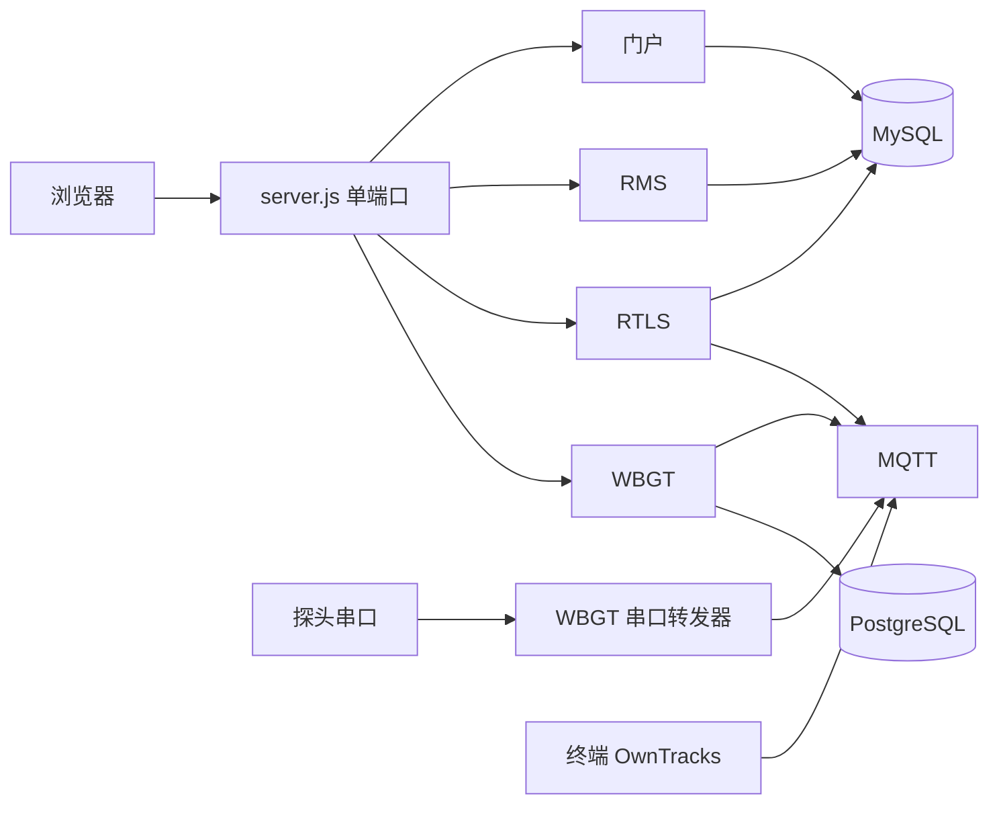

# dispatch-system

## 项目简介

面向 **赛事活动保障** 的组织总和平台：队员档案、现场响应调度（RMS）、实时定位（RTLS）、热环境监测（WBGT）。  


## 功能

- **门户**：统一登录、队员档案、公开检索、系统设置、顶栏导航
- **RMS**：现场响应终端、指挥台、状态大屏；急救表单可配置；弱网队列在浏览器本地
- **RTLS**：GPS 大屏 + 设备管理（默认适配OwnTracks MQTT）
- **WBGT**：湿球黑球温度大屏（MQTT 订阅探头数据）
- **首次安装**：显示安装页面，在第一次安装结束后写入lock文件


## WBGT 探头

平台订阅 MQTT 主题 `wbgt/#`，载荷为探头一行文本，例如：

```text
W25.3C:T28.1C:T32.4C:H42.0%LR
```

配套开源程序：**WBGT 串口转发器**（独立软件：本机串口 → `wbgt/{传感器编号}`）。
WBGT大屏默认看传感器 `1`。`MQTT_BROKER` 必须和转发器指向同一台 broker。

RTLS 订阅的是 OwnTracks（默认 `owntracks/#`），和 WBGT 主题分开。


## 页面入口

安装完成后登录，再打开：

| 模块 | 路径 |
|------|------|
| 登录 | `/login.php` |
| 门户工作台 | `/dashboard.php` |
| RMS 终端 | `/rms/` |
| RMS 指挥台 | `/rms/dispatch.html` |
| RMS 展示大屏 | `/rms/display.html` |
| 外部上报表格 | `/rms/report.html` |
| RTLS 大屏 | `/rtls/` |
| RTLS 设备管理 | `/rtls/admin.html` |
| WBGT | `/wbgt/` |
| 成员公开检索 | `/search.php` |


## 架构




## 部署

```bash
1.拉取仓库
2.npm install 命令用来安装模块
3.创建两个数据库用于RTLS业务和门户与RMS业务
3.npm start 命令启动服务并在浏览器打开终端输出的网址开始初始配置
4.初始配置结束后服务会自动终止
5.使用npm start 命令再次启动服务
```


### 依赖

| 必需 | 说明 |
|------|------|
| Node.js 18+ | |
| MySQL | 安装页账号需要有建库权限 |

| 可选 | 说明 |
|------|------|
| PostgreSQL | 不用 WBGT 可留空 |
| MQTT Broker（如 Mosquitto、EMQX等） | RTLS / WBGT 实时数据 |


## 项目贡献者（Contributors）

<a href="https://github.com/NorthCoastMedic/dispatch-system/graphs/contributors" target="_blank">
  
</a>

