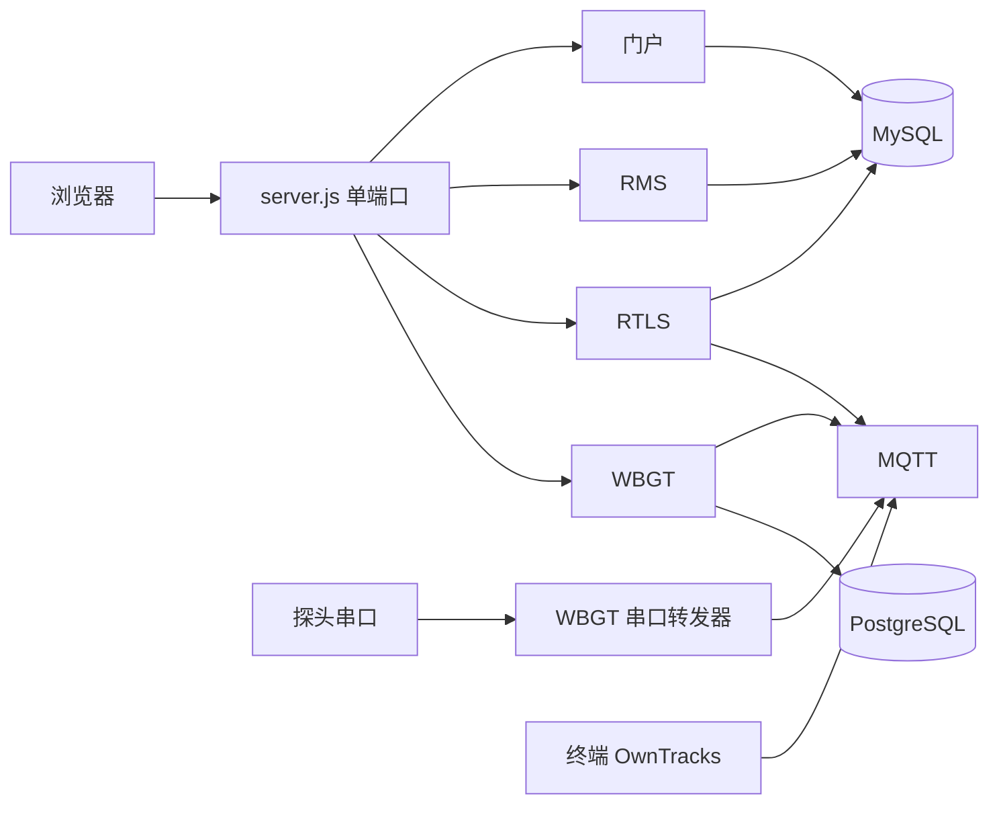

# dispatch-system

## 项目简介

面向 **赛事活动保障** 的组织总和平台：队员档案、现场响应调度（RMS）、实时定位（RTLS）、热环境监测（WBGT）。  


## 功能

- **门户**：统一登录、队员档案、公开检索、系统设置、顶栏导航
- **RMS**：现场响应终端、指挥台、状态大屏；急救表单可配置；弱网队列在浏览器本地
- **RTLS**：GPS 大屏 + 设备管理（默认适配OwnTracks MQTT）
- **WBGT**：湿球黑球温度大屏（MQTT 订阅探头数据）
- **PWA**：整站可「添加到手机主屏幕」，只有一个入口（门户）；断网时响应终端仍可切换状态，联网后自动上传
- **首次安装**：显示安装页面，在第一次安装结束后写入lock文件


## WBGT 探头

平台订阅 MQTT 主题 `wbgt/#`，载荷为探头一行文本，例如：

```text
W25.3C:T28.1C:T32.4C:H42.0%LR
```

配套开源程序：**WBGT 串口转发器**（独立软件：本机串口 → `wbgt/{传感器编号}`）。
WBGT大屏默认看传感器 `1`。`MQTT_BROKER` 必须和转发器指向同一台 broker。

RTLS 订阅的是 OwnTracks（默认 `owntracks/#`），和 WBGT 主题分开。


## 企业微信通知（自建应用）

RMS 的事件指派、取消指派、单呼、广播、新事件、事件完成与紧急报警都改用
**企业微信自建应用消息**（[message/send](https://developer.work.weixin.qq.com/document/path/90236)）
单独发送给个人，不再使用群机器人 Webhook（群机器人配置已停用，仅作留档）。

1. 企业微信后台创建自建应用，记录 `AgentId` 与 `Secret`；在「我的企业 → 企业信息」取 `CorpID`。
2. 把本服务器出口 IP 加入「我的企业 → 安全 → 可信企业 IP」（应用消息接口要求）。
3. 门户「系统设置 → RMS → 企业微信通知」填写 企业ID / AgentId / Secret；
   也可写入 `apps/rms/.env` 的 `WECOM_CORP_ID`、`WECOM_AGENT_ID`、`WECOM_SECRET`。


### 家宽动态 IP 与反向代理（errcode 60020）

自建应用接口要求调用方的出口 IP 在「企业可信IP」白名单内。家宽是动态 IP，一变就报
`60020 not allow to access from your ip`。若有一台固定公网 IP 的云服务器（例如用于备案 / 隐藏端口的反代机），
可让企业微信接口调用从云服务器出去，白名单里只填云服务器 IP：

1. 企业微信后台「企业可信IP」填**云服务器**的出口 IP。
2. 云服务器 nginx 增加一段转发（把 `<随机串>` 换成自己的随机字符串，避免被外人当跳板）：

    ```nginx
    location ^~ /wecom-api-<随机串>/ {
        proxy_pass https://qyapi.weixin.qq.com/;
        proxy_ssl_server_name on;
        proxy_set_header Host qyapi.weixin.qq.com;
        proxy_http_version 1.1;
        proxy_set_header Connection "";
        proxy_read_timeout 30s;
    }
    ```

3. 门户「系统设置 → RMS → 企业微信通知 → 接口根地址」填 `https://你的域名/wecom-api-<随机串>`；
   还可填「反代校验密钥」，请求会带 `X-Proxy-Key` 头，在 nginx 里加
   `if ($http_x_proxy_key != "同一段随机串") { return 403; }` 只允许本站调用。
   留空「接口根地址」即恢复直连官方域名。
4. 队员档案里的手机号就是企业微信绑定手机号：系统用 `user/getuserid` 换取 UserID 后逐个私聊发送；
   未绑定手机号的账号收不到企业微信消息。
5. 原「@全体」场景（新事件、事件完成、紧急报警）改为逐个发送给平台内所有
   已绑定手机号、且非离线（`users.status <> 6`）的成员。
6. 调度台顶部「指挥官」按钮可多选设置**本次指挥官**：设置后「新事件」与「事件完成」
   只通知指挥官（按指挥官绑定手机号单独发送）；清空后恢复通知全体非离线成员；
   紧急报警始终通知全体。名单存于系统设置 `rms.commander_user_ids`，每次修改写入设置日志。


## 页面入口

安装完成后登录，再打开：

| 模块 | 路径 |
|------|------|
| 登录 | `/login.php` |
| 门户工作台 | `/dashboard.php` |
| RMS 终端 | `/rms/` |
| RMS 指挥台 | `/rms/dispatch.html` |
| RMS 展示大屏 | `/rms/display.html` |
| 外部上报表格 | `/rms/report.html` |
| RTLS 大屏 | `/rtls/` |
| RTLS 设备管理 | `/rtls/admin.html` |
| WBGT | `/wbgt/` |
| 成员公开检索 | `/search.php` |


## 架构




## 部署

仓库只带 `.env.example`，不含填好的 `.env`。首次安装会在本机生成 `.env` 并写入 `SESSION_SECRET`、数据库密码等，不要把 `.env` 提交进 Git。

根目录 `.env` 的 `SESSION_SECRET` 必须是至少 16 位强随机串；未配置或仍是示例值时服务拒绝进入业务模式。

```bash
1.拉取仓库
2.npm install 命令用来安装模块
3.npm start 命令启动服务并在浏览器打开终端输出的网址开始初始配置（安装页会创建 .env 并建表）
4.初始配置结束后服务会自动终止
5.使用npm start 命令再次启动服务
```

已安装环境升级：不要删除现有 `.env` 和 `install.lock`。启动时不再删除旧表 `dispatch_logs`。新的系统设置键（如公开上报开关）需重启一次以写入默认值。非保障期间请在系统设置里关闭公开上报；活动期建议填写上报凭证，用 `/rms/report.html?token=...` 分发。


## PWA（添加到手机主屏幕）

整站是**一个 PWA**，`start_url` 固定为门户 `/dashboard.php`，装上后默认进门户；有网时门户内所有功能（含 RTLS / WBGT）照常使用。

**前提**

1. **必须用 HTTPS 域名访问**（或 `localhost`）。Service Worker 与「添加到主屏幕」只在安全上下文生效，用 `http://内网IP:端口` 打开不生效。
2. 走反向代理时，把根目录 `.env` 的 `TRUST_PROXY` 设为 `1`，否则登录 Cookie 可能异常。

**图标**：只需一张 **512×512 的 PNG**，放到 `apps/_shared/public/pwa/icon-source.png`，
或在「系统设置 → PWA → 应用图标」直接上传（服务端会重新编码成标准 PNG）。启动时会自动派生
`icon-192.png`、`icon-512.png`、`icon-maskable-512.png`、`apple-touch-icon.png`（180×180），不需要自己切图。

**安装名称 / 短名称 / 主题色**：「系统设置 → PWA」里改；留空则分别回落到「内部平台名称」和 `#0056b3`。
manifest 由 `/platform/pwa/manifest.webmanifest` 动态生成。

**手机安装**：安卓 Chrome 打开会提示安装；苹果 Safari 点「分享 → 添加到主屏幕」。

**离线行为**

- Service Worker（`/sw.js`，根作用域）缓存应用外壳与静态资源，缓存策略写在 `apps/_shared/public/pwa/sw.js`。
- 断网/弱网时响应终端可继续切换状态、接受/拒绝指派、上报事件、紧急报警；操作先存本机队列，恢复后按序自动回传。
- `/api/*` 与 socket.io **永不缓存**；门户页面按需存离线快照，出现登录页时会清空快照，避免换账号后串号。
- 改动缓存策略后，请把 `sw.js` 顶部的 `VERSION` 加一，旧缓存会自动清理。


### 依赖

| 必需 | 说明 |
|------|------|
| Node.js 18+ | |
| MySQL | 安装页账号需要有建库权限 |

| 可选 | 说明 |
|------|------|
| PostgreSQL | 不用 WBGT 可留空 |
| MQTT Broker（如 Mosquitto、EMQX等） | RTLS / WBGT 实时数据 |


## 许可

Copyright © 2026 pqzou

本仓库按 [PolyForm Noncommercial License 1.0.0](https://polyformproject.org/licenses/noncommercial/1.0.0) 授权，全文见 [`LICENSE`](./LICENSE)。

非商业用途下可以免费使用、修改与分发，须保留许可与署名。修改版须标明基于本项目，不得删除或伪造署名，也不得声称本软件由你独立开发。商业用途不允许。

欢迎通过 Issue 反馈问题，也欢迎 Pull Request。贡献者对其提交并被合并的代码保留著作权，合并不发生权利转让；该部分随本仓库按同一许可向公众提供，贡献者将出现在 Git 提交记录与贡献者列表中。

## 项目贡献者（Contributors）

<a href="https://github.com/NorthCoastMedic/dispatch-system/graphs/contributors" target="_blank">
  
</a>

